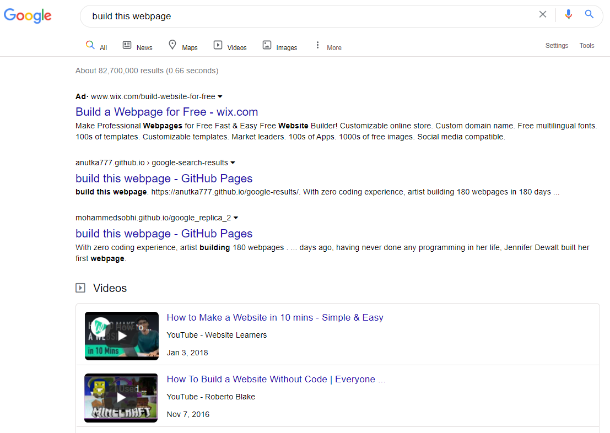

### `- Google SearchPage Clone -`

 

#### A Front-End challenge from [**The Odin Project**](https://www.theodinproject.com/courses/foundations/lessons/html-css#assignment)  !!

 

> The goal here was about copycating _Google SearchPage layout_, not much more [ no request // no back-end // hard-coding results ]
>
> > But I had really fun by adding some functionnalities by myself like Dropdown or Slider functions 🔥😎

 

 

